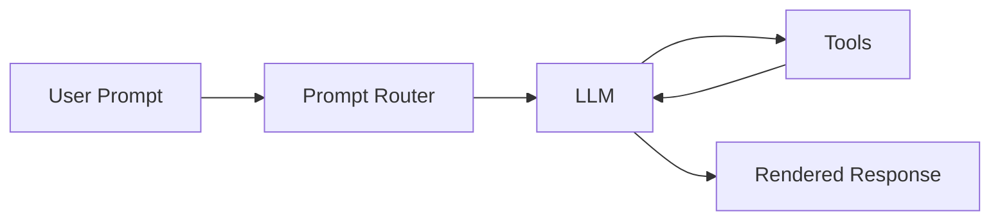

# bentra_ai

> An AI-themed markdown playground for testing rendering across your SaaS UI. 🤖


[](https://example.com)
[](https://example.com)
[](https://example.com)

## Overview

This README is intentionally packed with markdown features so you can verify:

- headings render correctly
- links are clickable
- images display inline
- tables align properly
- emojis show up as expected
- code blocks preserve formatting
- checklists, quotes, and callouts look good

## Why AI?

AI products often need to present lots of mixed content:

1. model summaries
2. prompt examples
3. metrics dashboards
4. generated images
5. structured notes and logs

This file gives you a little bit of all of that. ✨

---

## Quick Stats

| Metric | Value | Notes |
|:--|--:|:--|
| Active agents | 12 | Includes schedulers, reviewers, and assistants |
| Daily prompts | 48,231 | Simulated usage for demo purposes |
| Avg. latency | 842 ms | End-to-end request time |
| Accuracy score | 93.7% | Internal benchmark |
| Hallucination risk | Medium | Needs human review for critical tasks |

## AI Feature Matrix

| Feature | Supported | Priority | Emoji |
|---|---|---:|---|
| Chat completion | Yes | 1 | 💬 |
| Document summarization | Yes | 1 | 📝 |
| Image generation | Yes | 2 | 🎨 |
| Voice transcription | Partial | 2 | 🎙️ |
| Autonomous agents | Yes | 1 | 🤖 |
| Fine-tuning | Planned | 3 | 🧪 |

## Example Cards

### Assistant Personas

| Persona | Best For | Tone |
|---|---|---|
| Research Bot | Long-form synthesis | Analytical |
| Support Copilot | Customer replies | Friendly |
| Code Agent | Refactors and bug fixes | Direct |
| Data Analyst | Tables and reporting | Precise |

## Sample Images

### Banner Image


### Tiny Thumbnails


## Prompt Examples

### Basic Prompt

```text
You are an expert AI assistant.
Summarize the following support thread in 3 bullets.
Highlight risk, urgency, and next steps.
```

### JSON Output Prompt

```json
{
  "task": "classify_inbound_message",
  "labels": ["billing", "bug", "sales", "other"],
  "confidence_threshold": 0.8,
  "return_schema": {
    "label": "string",
    "confidence": "number",
    "reason": "string"
  }
}
```

### Python Snippet

```python
from dataclasses import dataclass


@dataclass
class ModelRun:
    name: str
    latency_ms: int
    passed: bool


run = ModelRun(name="demo-agent", latency_ms=812, passed=True)
print(run)
```

### TypeScript Snippet

```ts
type AgentResult = {
  id: string;
  summary: string;
  confidence: number;
};

const result: AgentResult = {
  id: "agt_123",
  summary: "The request is safe to automate.",
  confidence: 0.94,
};

console.log(result);
```

## Inline Formatting Test

Use `inline code`, **bold text**, *italic text*, ~~strikethrough~~, and ==highlight-style text if supported==.

You can also test keyboard tags like <kbd>Cmd</kbd> + <kbd>K</kbd> and superscripts like X<sup>2</sup>.

## Task List

- [x] Render markdown headings
- [x] Render tables
- [x] Render emojis 😄
- [x] Render images
- [x] Render fenced code blocks
- [ ] Render Mermaid diagrams
- [ ] Render footnotes
- [ ] Render embedded HTML consistently

## Blockquote

> "The best AI demos mix structure and chaos just enough to reveal rendering bugs."
>
> - A very opinionated test engineer

## Nested Content

- Models
  - Frontier
  - Fine-tuned
  - Small fast inference
- Inputs
  - Text
  - Images
  - Audio
- Outputs
  - Summaries
  - SQL
  - UI copy

## Mermaid



## Callout-Style Section

> [!NOTE]
> This is useful for testing whether GitHub-style callouts are supported in your markdown renderer.

> [!WARNING]
> Some markdown renderers will show this nicely. Others will treat it like a plain blockquote.

## Expandable Details

<details>
<summary>Click to expand an AI launch checklist</summary>

### Launch Checklist

1. Validate prompts
2. Test edge cases
3. Verify token limits
4. Add moderation
5. Add user-facing fallback states
6. Monitor latency and cost

</details>

## Mini Roadmap

| Quarter | Goal | Owner | Status |
|---|---|---|---|
| Q1 | Ship AI chat beta | Product | Done |
| Q2 | Add tool calling | Platform | In progress |
| Q3 | Add multimodal inputs | Applied AI | Planned |
| Q4 | Enterprise controls and audit logs | Security | Planned |

## Sample API Response

```http
HTTP/1.1 200 OK
Content-Type: application/json

{
  "id": "resp_01",
  "model": "assistant-demo",
  "status": "completed",
  "tokens_used": 1834,
  "output": "Your markdown renderer looks healthy."
}
```

## Links

- [OpenAI](https://openai.com/)
- [Anthropic](https://www.anthropic.com/)
- [Hugging Face](https://huggingface.co/)
- [Markdown Guide](https://www.markdownguide.org/)

## Footnote Test

Markdown with footnotes can be handy for model evaluations.[^1]

[^1]: This is a sample footnote for renderer testing.

## Final Note

If this all renders cleanly, your markdown support is in pretty good shape. If it breaks, that is useful too. 🛠️
